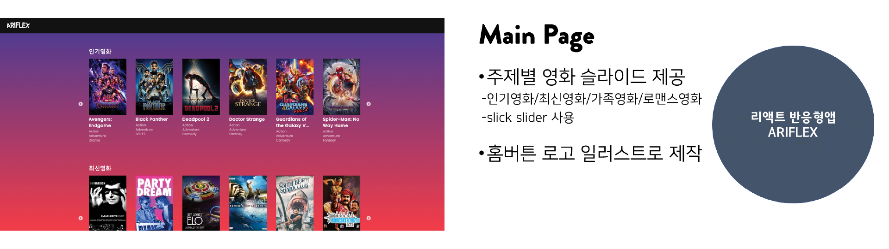

<h1>yts에서 제공하는 api를 활용하여 만든 리액트 웹사이트입니다.</h1>

반응형으로 제작되었습니다.

<h3>1.주요화면</h3>

<h3>2.사이트 요약</h3>

#최신순 #장르별 #영화상세정보

    
▪️ 제작기간 : 4일

    
▪️ 메인페이지에서 영화 탐색 가능

    
▪️ 최신순, 장르별 영화 : yts api 활용 / 각 페이지에서 영화 이미지 클릭시 yts api 활용한 상세 페이지로 이동

    
▪️ 영화상세정보에서 헤더 로고를 누르면 홈으로

 

 

 <h3>사용 언어</h3>
  
▪️ HTML5

  
▪️ CSS3

  
▪️ javaScript

  

  <h3>사용 라이브러리</h3>
  
▪️ React

  
▪️ slick slider

